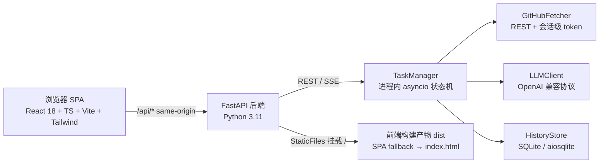

# PR Review Assistant（AI PR 评审助手）

> AI 驱动的 GitHub PR 评审助手：粘贴 PR 链接，自动抓取变更与必要上下文，生成定位到「文件 + 行号」的评审结果（变更总结 + 风险发现 + 可操作建议），并以 SSE 实时推送分析进度。

AI4SE 期末项目 · B 类 · 应用型项目。完整需求见 [《AI4SE_Final_Project_通用要求.md》](./AI4SE_Final_Project_通用要求.md) 与 [《AI4SE_Final_Project_B_应用类项目.md》](./AI4SE_Final_Project_B_应用类项目.md)。

---

## 目录

- [项目简介](#项目简介)
- [架构](#架构)
- [快速开始](#快速开始)
- [API](#api)
- [安全边界](#安全边界)
- [分发与部署](#分发与部署)
- [已知限制](#已知限制)
- [目录结构](#目录结构)
- [致谢与许可](#致谢与许可)

---

## 项目简介

- **目标用户**：在 GitHub 上协作的开发者 / 评审者 / 技术负责人。
- **解决什么**：把「理解变更意图 → 找问题 → 写建议」的机械流程交给 AI，评审者把精力放在高价值判断（设计、取舍、业务语义）上。
- **核心能力**：
  1. **变更总结**：这段改动做了什么、影响面、风险要点；
  2. **风险代码识别**：`bug / security / performance / maintainability / style` 五类，`critical / major / minor / nit` 四级严重度，带置信度，定位到文件与行号；
  3. **Review 建议**：每条发现附证据与可操作建议，支持过滤、排序、diff 行高亮与 Markdown 报告导出。
- **模型**：通过 OpenAI 兼容协议抽象 LLM 供应商（`base_url` / `model` / `api_key` 均可配置，默认 `https://api.deepseek.com` + `deepseek-v4-flash`）。
- **示例 PR**：内置稳定公开样例 `RobbinsNest/PR-Review-Assistant/pull/1`（本仓库首个合并 PR），前端「一键体验」按钮零配置演示；其 GitHub 响应已录制为离线 fixture（`backend/tests/fixtures/example_pr.json`）供集成测试使用。

---

## 架构



- **后端**（`backend/`）：FastAPI + pydantic v2 + aiosqlite；分析管线 `fetching → building → analyzing → verifying → aggregating → succeeded/failed/cancelled`；文件级并行（信号量，默认并发 4）+ 每文件 token 预算；LLM 输出经 pydantic 校验，JSON 解析失败自动带修复提示重试 1 次。
- **前端**（`frontend/`）：React 18 + TypeScript + Vite + Tailwind；原生 `EventSource` 消费 SSE（断线自动重连）；diff 基于 findings 行号高亮；设计遵循仓库 `DESIGN.md`（Open Design 契约，未引入桌面运行时，取舍说明见 [DESIGN.md](./DESIGN.md)）。
- **分发**：Docker 多阶段镜像（Node 20 构建前端 → Python 3.11-slim 运行），单容器同时服务 API 与 SPA；SQLite 数据卷持久化。

---

## 快速开始

### 方式一：Docker（推荐，一条命令启动）

```bash
cp .env.example .env          # 配置 LLM_API_KEY 等（见下）
docker compose up --build     # 或：make build && make run
# 打开 http://localhost:8000
curl http://localhost:8000/healthz   # -> {"status":"ok"}
```

`make` 目标：

```bash
make test     # 后端 pytest + 前端 vitest
make build    # docker build -t pr-review-assistant -f backend/Dockerfile .
make run      # docker run -p 8000:8000 --env-file .env -v prra-data:/app/data pr-review-assistant
```

> Windows 未安装 GNU make 时，等价命令为 `cd backend && pytest tests/` + `cd frontend && npm test -- --run`。

### 方式二：本地开发（后端 + 前端分离）

```bash
# 后端（Python 3.11+）
cd backend
pip install -e ".[dev]"
uvicorn app.main:app --reload --port 8000

# 前端（Node 20+）
cd frontend
npm ci
npm run dev        # Vite dev server，/api 代理到 http://localhost:8000
```

### 首次配置 LLM Key

- **Web**：打开设置页录入（只显示掩码 `sk-****1234`）。
- **CLI**：`python -m app.cli key set`（隐藏输入）。
- **容器 / 无头环境**：设置环境变量 `LLM_API_KEY`（镜像内 OS keyring 可能不可用，代码会自动回退到环境变量 / `backend/.env`）。

### 环境变量（见 `.env.example`）

| 变量 | 默认值 | 说明 |
|---|---|---|
| `LLM_API_KEY` | 空 | LLM API Key（密钥，永不入库/提交） |
| `LLM_BASE_URL` | `https://api.deepseek.com` | OpenAI 兼容 Base URL，**必须为公网 https** |
| `LLM_MODEL` | `deepseek-v4-flash` | 模型名 |
| `EXAMPLE_PR` | `RobbinsNest/PR-Review-Assistant/pull/1` | 示例 PR（`owner/repo/pull/N`） |
| `RATE_LIMIT_PER_MIN` | `10` | 每客户端 IP 每分钟请求数；`0` = 拒绝全部请求 |
| `CORS_ORIGINS` | 空（同源） | 逗号分隔的允许来源白名单 |
| `DATABASE_PATH` | `data/analyses.db` | SQLite 路径（容器内为 `/app/data/analyses.db`） |

---

## API

所有 API 返回 JSON；错误统一为 `{"error": {"code", "message"}}`。Swagger 文档：`http://localhost:8000/docs`。

| 方法 | 路径 | 说明 |
|---|---|---|
| GET | `/healthz` | 存活探针（Docker/CI/负载均衡用） |
| POST | `/api/analyze` | 提交分析：`{"pr_url": "...", "github_token": "可选"}` → `202 {task_id}` |
| GET | `/api/tasks/{task_id}` | 任务状态（含结果/错误） |
| GET | `/api/tasks/{task_id}/events` | SSE 进度流（`text/event-stream`，15s 心跳） |
| GET | `/api/history?limit=&offset=` | 历史分析列表 |
| GET | `/api/history/{id}` | 单条历史详情 |
| DELETE | `/api/history/{id}` | 删除记录（204） |
| GET | `/api/history/{id}/export` | Markdown 报告导出 |
| GET | `/api/settings/llm` | 当前 LLM 配置（掩码） |
| PUT | `/api/settings/llm` | 更新 base_url / model / api_key |
| DELETE | `/api/settings/llm` | 清除 LLM Key |
| POST | `/api/settings/llm/test` | LLM 连通性探测 |

---

## 安全边界

- **凭据铁律**：key/token 绝不硬编码、绝不提交 git、绝不写入日志或终端历史。LLM Key 优先 OS keyring，其次 `LLM_API_KEY` 环境变量 / `backend/.env`（gitignored）；Web/CLI 只显示掩码。GitHub token 仅会话内存，任务结束即释放，不落库、不进日志（`_public_state` 显式剔除）。
- **base_url 校验**：`PUT /api/settings/llm` 拒绝非 https、回环、内网/链路本地地址与内嵌凭据的 URL（防 key 外泄到内部端点）。
- **限流**：`RATE_LIMIT_PER_MIN` 为每客户端 IP 的令牌桶（默认 10/min）；**`0` 表示拒绝全部请求**（安全兜底，非「不限流」）。注意：限流基于直连对端 IP（`request.client.host`），**反向代理后 X-Forwarded-For 不可信**——如需按真实客户端 IP 限流，请在可信反代处处理并转发。
- **公网部署**：设置类端点（`/api/settings/*`，可改写 LLM Key 与 base_url）在公开部署时应置于反向代理认证之后；建议同时配置 `CORS_ORIGINS` 白名单与反代 HTTPS。
- **LLM 输出**：pydantic 强制 schema 校验 + 修复提示重试；findings 的 `line_start/line_end` 必须落在变更行范围内（校验阶段强制）。
- **静态托管**：FastAPI 在 `STATIC_DIR`（默认 `frontend/dist`）存在时挂载 `/` 提供 SPA；`/api` 与 `/healthz` 路由先注册，不受挂载遮蔽；未知 `/api/*` 仍返回 JSON 404（不回退 SPA 外壳）。

---

## 分发与部署

### 镜像获取与运行（目标机）

镜像通过仓库根目录 `backend/Dockerfile` 构建（CI 的 `docker-build` job 每次 push 验证可构建）：

```bash
git clone https://github.com/RobbinsNest/PR-Review-Assistant.git
cd PR-Review-Assistant
docker build -t pr-review-assistant -f backend/Dockerfile .
# 或 docker compose up --build
docker run -p 8000:8000 --env-file .env -v prra-data:/app/data pr-review-assistant
```

**目标机关键配置**：

1. `LLM_API_KEY`：容器内优先通过环境变量注入（镜像内 keyring 依赖系统密钥环，通常不可用，代码自动回退环境变量）。
2. `LLM_BASE_URL` / `LLM_MODEL`：必须是可公网访问的 https 端点。
3. `EXAMPLE_PR`：按需改为团队仓库的公开样例。
4. `RATE_LIMIT_PER_MIN`：公网部署建议保持正数（默认 10）。
5. `CORS_ORIGINS`：前端与后端不同源时配置。
6. 数据持久化：`DATABASE_PATH=/app/data/analyses.db` + 数据卷挂载 `/app/data`（镜像内已默认，`docker-compose.yml` 使用 `prra-data` 卷）。
7. 反向代理：建议置于 Nginx/Caddy 之后启用 HTTPS，并对 `/api/settings/*` 加认证、关闭 SSE 缓冲（本项目已发 `X-Accel-Buffering: no` + 心跳）。

平台无关，适配 Render / Railway / Fly.io / 云服务器。

### CI

- **GitHub Actions**（`.github/workflows/ci.yml`）：每次 push/PR 运行 `unit-test`（Python 3.11 pytest + Node 20 vitest/build）与 `docker-build`（多阶段镜像构建）。
- **GitLab CI**（`.gitlab-ci.yml`）：等价流水线，含必需的 `unit-test` job（`image: python:3.11`，`pytest backend/tests -q`）与 `frontend-test` job（Node 20）。

---

## 已知限制

- **单进程 / 内存态**：任务管理在进程内（无 Redis/队列），多副本部署需外部调度；限流器为单进程内存令牌桶。
- **SQLite 单机**：适合单实例；高并发写入与多机共享需换数据库。
- **GitHub 未认证限额**：未带 token 约 60 次/小时；高频使用请填写 token（会话级，不落库）。
- **超大 PR**：默认上限 50 文件或 2MB diff，超过返回明确错误（可配）。
- **上下文启发式**：hunk→函数/类上下文窗口为启发式定位，失败退化为 ±N 行 / diff-only。
- **LLM JSON 稳定性**：已做 schema 校验 + 修复重试 + 兜底解析，但极端情况仍可能失败并明确报错。
- **单租户**：无用户体系与多租户隔离，历史记录不按用户区分。
- **不写回 GitHub**：只读分析，不自动评论。

---

## 目录结构

```
PR-Review-Assistant/
├── SPEC.md / PLAN.md / SPEC_PROCESS.md / AGENT_LOG.md / README.md / REFLECTION.md
├── DESIGN.md                        # Open Design 设计契约
├── docs/superpowers/specs/…design.md # 设计底稿
├── backend/
│   ├── app/
│   │   ├── main.py                  # FastAPI 入口 + SPA 静态挂载（SPA fallback）
│   │   ├── api/                     # analyze/tasks/history/settings/health
│   │   ├── core/                    # config/logging/errors/rate_limit
│   │   ├── models/                  # pydantic schemas
│   │   ├── services/                # github_fetcher/context_builder/llm_client/
│   │   │                            #   analysis_engine/task_manager/history_store/credentials
│   │   └── cli.py                   # key set/status/clear
│   ├── tests/
│   │   └── fixtures/example_pr.json # 示例 PR 离线 GitHub fixture
│   ├── pyproject.toml / requirements.txt
│   └── Dockerfile                   # 多阶段镜像（Node 20 → Python 3.11-slim）
├── frontend/                        # React 18 + TS + Vite + Tailwind（src/）
├── .github/workflows/ci.yml         # GitHub Actions（unit-test + docker-build）
├── .gitlab-ci.yml                   # GitLab CI（unit-test + frontend-test）
├── docker-compose.yml               # 便利启动（端口 8000，SQLite 卷）
├── .env.example
├── Makefile                         # test / build / run
└── .gitignore / .dockerignore
```

---

## 致谢与许可

- **模型**：DeepSeek（默认演示供应商）及其他 OpenAI 兼容供应商。
- **前端**：React、Vite、Tailwind CSS、`diff`（diff 解析）。
- **后端**：FastAPI、Starlette、Pydantic、httpx、aiosqlite、keyring。
- **设计系统**：遵循 [Open Design](https://github.com/nexu-io/open-design) 的 `DESIGN.md` 契约（本项目直接落地其规范，不引入桌面运行时/CLI）。
- 本项目为课程教学用途（AI4SE 期末项目），代码可自由使用与修改。
